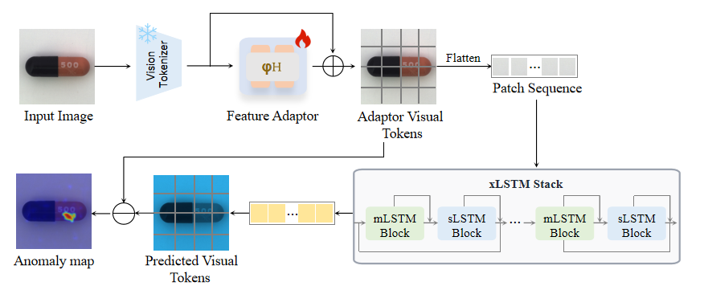
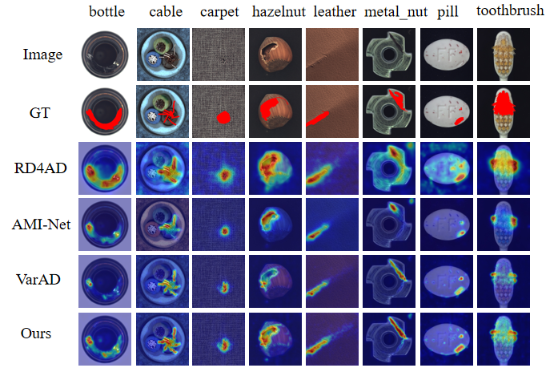
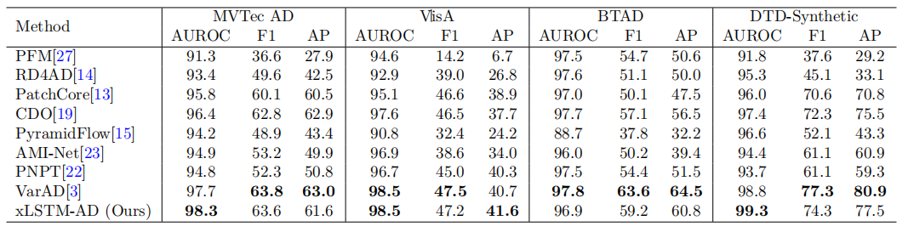
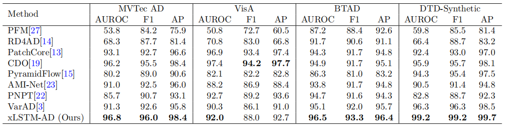

# xLSTM-AD: Lightweight Image Anomaly Detection via Extended Long Short-Term Memory Modeling


## Abstract

> This paper presents xLSTM-AD, a high-fidelity and computationally efficient framework for visual anomaly detection (AD) leveraging the Extended Long Short-Term Memory (xLSTM) architecture. While the visual autoregressive paradigm has demonstrated significant potential by framing AD as a sequential token prediction task, its performance is heavily dependent on the model's ability to capture intricate spatial dependencies. We propose an architecture that integrates a pre-trained DINO vision tokenizer with xLSTM, leveraging the latter's matrix-valued memory and exponential gating structures to effectively model the latent manifold of normal patterns. Unlike previous sequence models that often suffer from information bottlenecks, xLSTM provides a more expressive representation space for complex industrial features while maintaining linear computational complexity. Specifically, xLSTM-AD performs precise autoregressive forecasting, isolating anomalies through the quantification of reconstruction discrepancies. Experimental results on four primary benchmarks—MVTec AD, VisA, BTAD, and DTD-Synthetic—demonstrate that xLSTM-AD achieves state-of-the-art performance, with AUROC scores of 96.8\%, 92.0\%, 96.5\%, and 99.2\%, respectively. These findings confirm that xLSTM serves as a superior backbone for modeling the nuanced sequential logic essential for high-precision industrial anomaly detection.

## Framework



## Features

1)xLSTM-Based Autoregressive Backbone: We propose integrating xLSTM's matrix-valued memory cells and exponential gating mechanisms into the visual autoregressive AD paradigm, enabling more expressive sequential modeling of complex spatial dependencies while preserving linear computational complexity — directly addressing the information bottleneck of existing SSM-based approaches.

2)Systematic Framework Design: We develop xLSTM-AD, an end-to-end framework that combines hierarchical DINOv2-based tokenization with an optimized xLSTM predictor, effectively bridging visual representation learning and sequential density estimation for precise anomaly localization.

3)Empirical Validation: Comprehensive experiments on four widely used industrial benchmarks — MVTec AD, VisA, BTAD, and DTD-Synthetic — demonstrate that xLSTM-AD consistently achieves state-of-the-art performance, with image-level AUROC scores of 96.8%, 92.0%, 96.5%, and 99.2%, respectively, confirming the advantage of matrix-valued memory for both local defect localization and global anomaly discrimination.

## Install

```bash
sh init.sh # note that there may be some remained bugs
```

Modify `./config/global_config.py` to match your data directory.

## Run

```bash
python main.py --image_size 512 --model dinov2_vits14
```
## Results
Qualitative comparison of anomaly localization results between xLSTM-AD and competing methods.


Pixel-Level Anomaly Detection Performance (AUROC% / Max-F1% / AP%)


Image-Level Anomaly Detection Performance (AUROC% / Max-F1% / AP%)

## Acknowledgement
This project is developed based on the ideas and open-source implementation of VarAD. We sincerely thank the authors for their valuable contributions to the anomaly detection community.

VarAD: https://github.com/caoyunkang/VarAD
