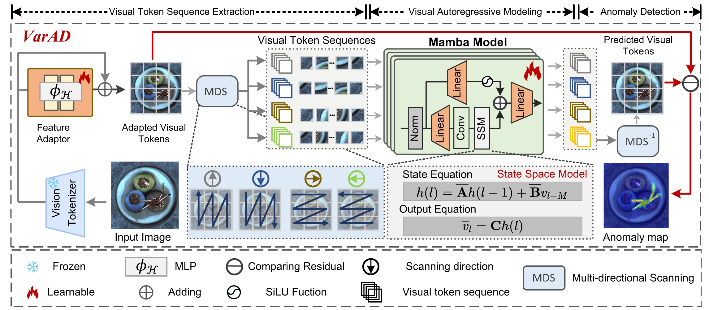
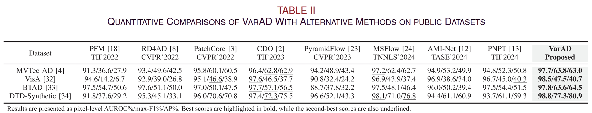

# VarAD: Lightweight High-Resolution Image Anomaly Detection via Visual Autoregressive Modeling


## Abstract

> This paper presents \textbf{xLSTM-AD}, a high-fidelity and computationally efficient framework for visual anomaly detection (AD) leveraging the Extended Long Short-Term Memory (xLSTM) architecture. While the visual autoregressive paradigm has demonstrated significant potential by framing AD as a sequential token prediction task, its performance is heavily dependent on the model's ability to capture intricate spatial dependencies. We propose an architecture that integrates a pre-trained DINO vision tokenizer with xLSTM, leveraging the latter's matrix-valued memory and exponential gating structures to effectively model the latent manifold of normal patterns. Unlike previous sequence models that often suffer from information bottlenecks, xLSTM provides a more expressive representation space for complex industrial features while maintaining linear computational complexity. Specifically, xLSTM-AD performs precise autoregressive forecasting, isolating anomalies through the quantification of reconstruction discrepancies. Experimental results on four primary benchmarks—MVTec AD, VisA, BTAD, and DTD-Synthetic—demonstrate that xLSTM-AD achieves state-of-the-art performance, with AUROC scores of 96.8\%, 92.0\%, 96.5\%, and 99.2\%, respectively. These findings confirm that xLSTM serves as a superior backbone for modeling the nuanced sequential logic essential for high-precision industrial anomaly detection.

## Framework



## Install

```bash
sh init.sh # note that there may be some remained bugs
```

Modify `./config/global_config.py` to match your data directory.

## Run

```bash
python main.py --image_size 512 --model dinov2_vits14
```

## Performance under 1024 Resolution



## BibTex

```bibtex
@ARTICLE{VarAD,
  author={Cao, Yunkang and Yao, Haiming and Luo, Wei and Shen, Weiming},
  journal={IEEE Transactions on Industrial Informatics}, 
  title={VarAD: Lightweight High-Resolution Image Anomaly Detection via Visual Autoregressive Modeling}, 
  year={2025},
  volume={21},
  number={4},
  pages={3246-3255},
  keywords={Visualization;Predictive models;Adaptation models;Anomaly detection;Reactive power;Transformers;Image reconstruction;Computational modeling;Inspection;Feature extraction;Autoregressive modeling;image anomaly detection;token prediction},
  doi={10.1109/TII.2024.3523574}}
```

## Index Terms

- Autoregressive modeling
- Image anomaly detection
- Token prediction
